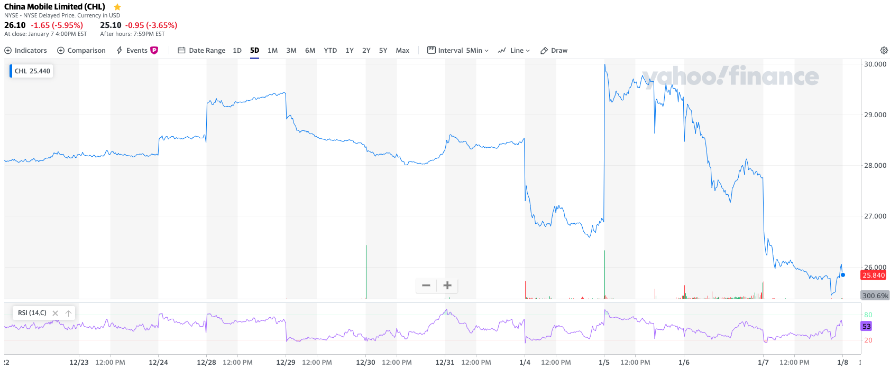
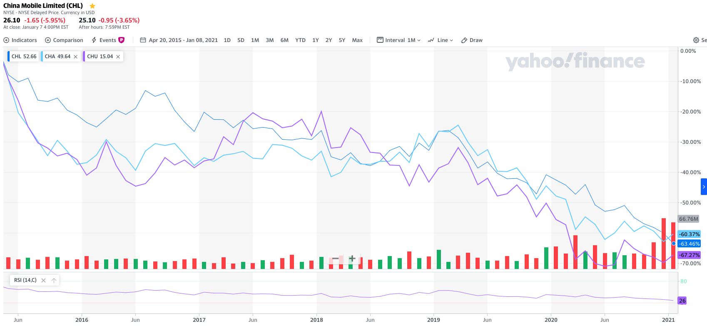
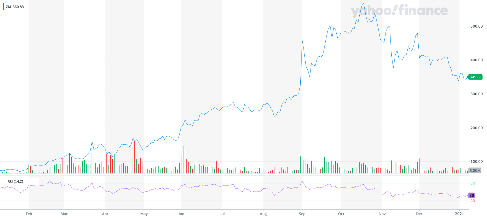
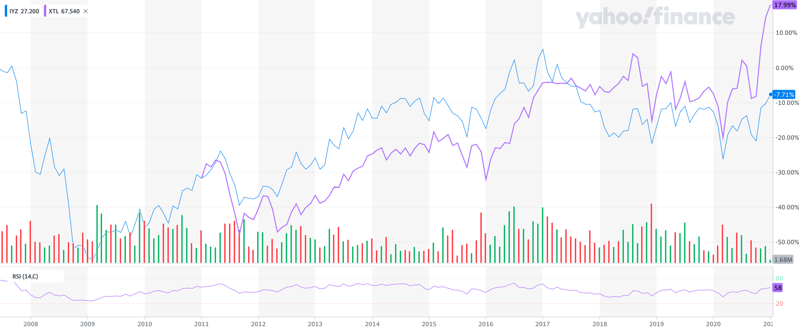
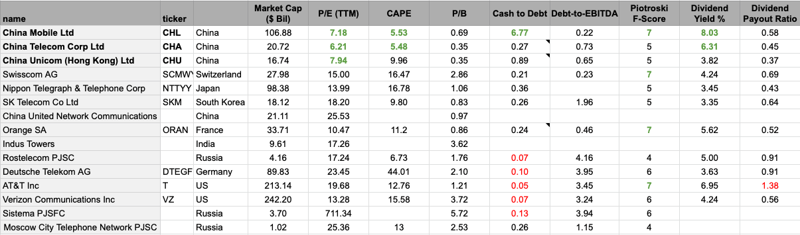

### Intro

Z otwarciem sesji NYSE w poniedziałek 11 stycznia mają być zdjęte trzy chińskie spółki:

- China Mobile Ltd (CHL:NYSE, 0941:HKSE),
- China Telecom Corp Ltd (CHA:NYSE, 0728:HKSE),
- China Unicom Ltd (CHU:NYSE, 0762:HKSE).

Myślę, że może to być okazja inwestycyjna.

_Piszę ten artykuł w niedzielę wieczór, jednak sytuację tych spółek analizowałem w nocy z czwartku na piątek.
Stąd też większość danych i wskaźników brałem przy kursach z zamknięcia NYSE w czwartek (7.01.2021).
Cena China Mobile (0941:HKSE) wahała się między 40 a 42 HKD._

### Executive Order 13959

12 listopada 2020 prezydent Trump podpisał [Executive Order 13959][executive-order-13959].
Zarządzenie to zabrania wszystkim inwestorom amerykańskim, zarówno indywidualnym jak instytucjonalnym, inwestycji w firmy
zidentyfikowane przez Pentagon jako _"Communist Chinese military companies"_.
Innymi słowy, jeżeli firma współpracuje z chińskim wojskiem, wkrótce amerykańscy inwestorzy nie będą w stanie jej kupić,
pośrednio lub bezpośrednio.

Na pierwszy ogień poszły trzy firmy z branży telekomunikacyjnej:
China Mobile Ltd (CHL:NYSE), China Telecom Corp Ltd (CHA:NYSE) i China Unicom Ltd (CHU:NYSE).
Do wczoraj jednak nie było wiadomo, czy będą one zdjęte czy też nie:

  - Thu, 31.12 
    [_The New York Stock Exchange announced today (...) to delist the securities of the following issuers (...) CHA, CHL, CHU_][theice-3112]
     

  - Mon, 4.01: 
    [_NYSE no longer intends to move forward with the delisting_][theice-0401]
     

  - Tue, 5.01: 
    - [_Mnuchin (...) express his displeasure with the decision to let the three firms keep trading_][bloomberg-0601]
       

    - [_"Office of Foreign Assets Control provided to the NYSE (...) new specific guidance"_][bloomberg-0601]
       

    - [FAQ #864][faq-864] - "new specific guidance" provided by OFAC to NYSE
       

  - Wed, 6.01: 
    [_"NYSE has announced today that NYSE Regulation will move forward" the delisting of the issuers_][theice-0601]
     

Nagłe zmiany stanowiska NYSE odzwierciedla wykres China Mobile (CHL:NYSE).

Z chwilą wypuszczenia informacji kurs CHL na poszedł ponad 11% w górę.

  _“It’s odd for the NYSE to get this so wrong,” said Bloomberg Intelligence analyst Larry Tabb.
  “Their marketing and public relations team has historically been one of the best.
  It’s bad enough to do a 180 on this within a week, but to go 360 degrees on such a major move
  so quickly means that they either got this terribly wrong, or there was significant outside
  pressure driving these decisions.”_
   Source: [Bloomberg][bloomberg-0601]

Możemy tylko zgadywać, czy to autentyczna pomyłka, wynikająca z niejasności Executive Order i FAQs,
czy może też ktoś na tym zarobił świadomie (tzw. krótka pompka).

### _"Bój się, kiedy wszyscy są chciwi. Bądź chciwy, kiedy wszyscy się boją."_

Od listopada wspomniane Chińskie firmy straciły a ok. 20-25%.
W ciągu ostatnich 5 lat każda z trzech spółek zaliczyła -60%.
Trend jest jednak dłuższy, spółki spadają mniej więcej od 12-13 lat, z łączną obniżką na poziomie -75% w cenie.

Source: ([Finance Yahoo][finance-yahoo-5-years])

Ile spółka może nadal spadać? Nie wiem, jednak potencjał do dalszych spadków nie jest duży.

### _"Sprzedawaj plotki, kupuj fakty"_

Przy pozytywnym wydarzeniu mówi się często o sytuacjach typu "kupuj plotki, sprzedawaj fakty".
Dla przykładu akcje spółki Zoom rosły cały rok 2020 w oczekiwaniu na kolejny lockdown.

Source: ([Finance Yahoo][finance-yahoo-zoom-2020])

Sezon jesienny się rozpoczął, zachorowania poszły w górę.
Notowania spółki zaś poszły w dół, pomimo "pożądanego" obrotu spraw dla spółki.
Inna analogia: [spółki gier][bankier-kupuj-plotki].
Ogłaszają premierę, jest marketing, ludzie się „zakochują” w spółce,
po czym do premiery dochodzi i niezależnie od sukcesu czy porażki kurs idzie w dół.

W obu przypadkach mamy do czynienia z pozytywnym wydarzeniem ciągnącym kurs w górę.
W tym przypadku, w przypadku negatywnego wydarzenia, spodziewam się odwrotnej sytuacji.
Kto miał sprzedać, już sprzedał. Zostali tylko ci, którzy trzymają w długim terminie.

Spójrzmy na to inaczej.
Weźmy, że hipotetycznie ktoś otworzył shorta w listopadzie na jedną z wymienionych spółek.
Teraz, w chwili, gdy wielu się wyprzedało i kurs poszedł w dół, ten ktoś z zyskiem +30% może taką pozycję zamknąć.
Nie wiedząc co będzie się działo po 11.01, ja bym nie czekał. Zamknąłbym pozycję z zyskiem.
_"Sprzedawaj plotki, kupuj fakty"_.

### Jak wygląda sektor?

Starałem się oszacować branżę Telecom z perspektywy funduszy ETF i pojedynczych spółek.

Wśród ETF nie znalazłem dobrego instrumentu odzwierciedlającego globalną branżę telecom.
Przez branżę telecom mam tu na myśli producentów infrastruktury telekomunikacyjnej fizycznej,
nie firmy działające w internecie. W tem sposób wyleciała praktycznie większość ETF zawierająca firmy
na pierwszy rzut oka firmy tj. Alphabet, Facebook, Netflix, Walt Disnay, Twitter.
Zostały mi dwa: [IYZ](https://etfdb.com/etf/IYZ/#holdings), [XTL](https://etfdb.com/etf/XTL/#holdings).
Wada jest taka, że mają ekspozycję tylko na US.

W lipcu 2007 telecom był na górce. IYZ w 2017 przebił ten poziom, ale od tamtej pory się nie podniósł.
XTL z kolei zwyżkuje i jest najdroższy w swojej historii. Trzeba jednak wziąć poprawkę na to,
że oba ETFy skupiają się na firmach notowanych w stanach i jest tam po prostu drogo. Jak fundamenty owych ETF? Średnio-drogie:
[XTL](https://www.gurufocus.com/etf/XTL) (PE: 22, PB: 1.97),
[IYZ](https://www.gurufocus.com/etf/IYZ) (PE: 17.07, PB: 1.9).

Jak z kolei wygląda porównanie owych spółek w zestawieniu indywidualnym? Tu akurat chińskie spółki błyszczą:

W porównaniu wybrałem parę spółek o kapitalizacji powyżej $1bln i uszeregowałem je, subiektywnie, wg. atrakcyjności.
Na czele trzy chińskie spółki które wylatują z NYSE,
na końcu spółki rosyjskie, niemieckie Deutsche Telecom i amerykańskie AT&T.

Liczby mówią za siebie. Chińskie spółki są atrakcyjniejsze niż cała reszta.
Niski poziom długu. Niskie wyceny. W przypadku CHL i CHA trochę martwiące jest,
że P/E jest wyższe niż CAPE, co przy spadającym kursie od 10 lat, jest zastanawiające.
Może to oznaczać, że zyski spadają szybciej niż cena.
Z drugiej strony może to wynikać ze wzrostu ceny USD do CNY w 2019 i 2020.
Ciężko stwierdzić. Dobrze by było zobaczyć zeznanie finansowe w CNY i obliczyć wskaźniki samemu (TODO).
Jednak nadal, fundamenty dla tych trzech firm są lepsze niż dla którejkolwiek z pozostałych.

[comment]: <> (TODO: Obliczyć wskaźniki samemu lub znaleźć liczone dla CNY.)

### Co dalej?

Czy amerykański inwestor będzie mógł kupić wymienione spółki po 11 stycznia?
Z pewnością nie z użyciem instrumentów notowanych w US, czy to bezpośrednio czy pośrednio (przez zakup funduszu).
Za to będzie miał możliwość utrzymania pozycji do 11 listopada 2021,
która najprawdopodobniej zostanie przesunięta do rynku [OTC][fool-otc].

Czy amerykański inwestor będzie mógł kupić wymienione spółki po 11 stycznia na innych giełdach na świecie?
Nie wiem. Nie doczytałem się na tyle głęboko.

Warto zauważyć, że fundusze musiały się pozbyć tych spółek teraz.
Doprowadziło to do sytuacji, że indeksy, w tym MSCI China Index, który powinien odzwierciedlać rynek chiński,
usuwa firmę taką jak China Mobile ([link][scmp-msci-drop]).
China Mobile stanowi 14 pozycję wśród 593 firm, które ten indeks śledzi.

Bloomberg podał, że w piątek na HKSE wolumen Chine Mobile (00941:HKSE)
sięgnął 5.7 bln HKD, przy czym średni wolumen wynosi 64 mln HKD, a kapitalizacja spółki to 886.5 bln HKD,
czyli wolumen w piątek skoczył 85-krotnie, odpowiadając za 0.6% kapitalizacji całej spółki
([link][bloomberg-msci-cuts]).

Podejrzewam, że to fundusze odpowiadały za ten obrót.
W takim wypadku, jak ktoś miał się wyprzedać, już się wyprzedał.

### Moje plany

#### Timing

Długo się wahałem w czwartek w nocy nad kupieniem pakietu CHL, ale postanowiłem poczekać jeszcze.
Cena CHL już teraz wydaje się dobra, jednak myślę że cena może jeszcze zejść stopień niżej.
Jeżeli nie, cóż, niech skorzystają inni.

W tej chwili rozważam kupno pakietu w nocy z niedzieli na poniedziałek na HKSE, przed rozpoczęciem sesji NYSE,
lub w pierwszych dwóch dniach następnego tygodnia.
_A może za bardzo "chciwy" jestem? Może powinienem kupić od razu i kupić sobie spokój?_

#### Jak długo zostać przy spółce?
Myślę, że przynajmniej 2-3 lata, a możliwe że i dekadę. Czas pokaże.

#### Kiedy wyjść?

- kiedy będą przesłanki za tym, że gospodarka chińska może mieć problemy i inwestorzy masowo będą się ewakuować z Chin
  (wojna),
- jak CHL przestanie płacić dywidendy,
- kiedy spółka zrobi się droga (PE 30, PB 3) a ja będę miał tańszy instrument na oku.

#### Dlaczego dodaję ją do portfela?

- bo jest tania i ma duży potencjał do wzrostu,
- płaci wysokie dywidendy: 7-8% rocznie,
- wydaje się być na chwilowej promocji związanej z politycznym zamieszanie i związaną z tym małą paniką.

[comment]: <> (Widziałem właśnie [artykuł]&#40;https://realmoney.thestreet.com/investing/stocks/bearish-bets-2-stocks-you-should-consider-shorting-this-week-15534136?puc=yahoo&cm_ven=YAHOO&#41;)
[comment]: <> (sugerujący w oparciu o analizę techniczną shortowanie China Mobile do ceny $22 &#40;z poziomów ~$27&#41;.)

[comment]: <> (Z drugiej strony, znalazłem [inny]&#40;https://finance.yahoo.com/news/lessons-china-mobile-nyse-flip-161844691.html&#41;)
[comment]: <> (który w opaciu o analizę fundamentalną był mocno pozytywnie nastawiony.)

### Linki:

- CHA: [GuruFocus](https://www.gurufocus.com/stock/CHA/summary),
  [FinViz](https://finviz.com/quote.ashx?t=CHA),
  [Investing.com](https://www.investing.com/equities/china-telecom)

- CHL: [GuruFocus](https://www.gurufocus.com/stock/CHL/summary),
  [FinViz](https://finviz.com/quote.ashx?t=CHL),
  [Investing.com](https://www.investing.com/equities/china-mobile)

- CHU: [GuruFocus](https://www.gurufocus.com/stock/CHU/summary),
  [FinViz](https://finviz.com/quote.ashx?t=CHU),
  [Investing.com](https://www.investing.com/equities/china-unicom)

[bloomberg-0601]: https://www.bloomberg.com/news/articles/2021-01-06/nyse-reverses-course-again-with-plan-to-delist-chinese-telecoms
[bloomberg-msci-cuts]:https://finance.yahoo.com/news/msci-cuts-china-telcos-indexes-012516278.html
[scmp-msci-drop]: https://finance.yahoo.com/news/msci-drop-china-mobile-two-093000752.html
[theice-3112]: https://ir.theice.com/press/news-details/2020/NYSE-to-Commence-Delisting-Proceedings-in-Securities-of-Three-Issuers-to-Comply-with-Executive-Order-13959/default.aspx
[theice-0401]: https://ir.theice.com/press/news-details/2021/NYSE-Updates-Guidance-on-Delisting-Determination-for-Securities-of-Three-Issuers-in-Relation-to-Executive-Order-13959--/default.aspx
[theice-0601]: https://ir.theice.com/press/news-details/2021/NYSE-Announces-Suspension-Date-for-Securities-of-Three-Issuers-and-Proceeds-with-Delisting/default.aspx
[faq-861]: https://home.treasury.gov/policy-issues/financial-sanctions/faqs/861
[faq-862]: https://home.treasury.gov/policy-issues/financial-sanctions/faqs/862
[faq-864]: https://home.treasury.gov/policy-issues/financial-sanctions/faqs/864
[faq-865]: https://home.treasury.gov/policy-issues/financial-sanctions/faqs/865
[executive-order-13959]: https://www.whitehouse.gov/presidential-actions/executive-order-addressing-threat-securities-investments-finance-communist-chinese-military-companies/
[executive-order-13959-pdf]: https://home.treasury.gov/system/files/126/13959.pdf
[bankier-kupuj-plotki]: https://www.bankier.pl/wiadomosc/Kupuj-plotki-sprzedawaj-fakty-w-branzy-gier-7646546.html
[fool-otc]: https://www.fool.com/investing/stock-market/exchange/otc-markets/
[finance-yahoo-5-years]: https://finance.yahoo.com/chart/CHL#eyJpbnRlcnZhbCI6Im1vbnRoIiwicGVyaW9kaWNpdHkiOjEsInRpbWVVbml0IjpudWxsLCJjYW5kbGVXaWR0aCI6MjMuNDc4MjYwODY5NTY1MjIsInZvbHVtZVVuZGVybGF5Ijp0cnVlLCJhZGoiOnRydWUsImNyb3NzaGFpciI6dHJ1ZSwiY2hhcnRUeXBlIjoibGluZSIsImV4dGVuZGVkIjpmYWxzZSwibWFya2V0U2Vzc2lvbnMiOnt9LCJhZ2dyZWdhdGlvblR5cGUiOiJvaGxjIiwiY2hhcnRTY2FsZSI6InBlcmNlbnQiLCJwYW5lbHMiOnsiY2hhcnQiOnsicGVyY2VudCI6MC44LCJkaXNwbGF5IjoiQ0hMIiwiY2hhcnROYW1lIjoiY2hhcnQiLCJpbmRleCI6MCwieUF4aXMiOnsibmFtZSI6ImNoYXJ0IiwicG9zaXRpb24iOm51bGx9LCJ5YXhpc0xIUyI6W10sInlheGlzUkhTIjpbImNoYXJ0Iiwidm9sIHVuZHIiLCLigIx2b2wgdW5kcuKAjCJdfSwi4oCMcnNp4oCMICgxNCxDKSI6eyJwZXJjZW50IjowLjIsImRpc3BsYXkiOiLigIxyc2nigIwgKDE0LEMpIiwiY2hhcnROYW1lIjoiY2hhcnQiLCJpbmRleCI6MSwieUF4aXMiOnsibmFtZSI6IuKAjHJzaeKAjCAoMTQsQykiLCJwb3NpdGlvbiI6bnVsbH0sInlheGlzTEhTIjpbXSwieWF4aXNSSFMiOlsi4oCMcnNp4oCMICgxNCxDKSJdfX0sImxpbmVXaWR0aCI6Miwic3RyaXBlZEJhY2tncm91bmQiOnRydWUsImV2ZW50cyI6ZmFsc2UsImNvbG9yIjoiIzAwODFmMiIsInN0cmlwZWRCYWNrZ3JvdWQiOnRydWUsImV2ZW50TWFwIjp7ImNvcnBvcmF0ZSI6eyJkaXZzIjpmYWxzZSwic3BsaXRzIjpmYWxzZX0sInNpZ0RldiI6e319LCJjdXN0b21SYW5nZSI6eyJzdGFydCI6MTQzMDQzNDgwMDAwMCwiZW5kIjoxNjA2NzgwODAwMDAwfSwic3ltYm9scyI6W3sic3ltYm9sIjoiQ0hMIiwic3ltYm9sT2JqZWN0Ijp7InN5bWJvbCI6IkNITCIsInF1b3RlVHlwZSI6IkVRVUlUWSIsImV4Y2hhbmdlVGltZVpvbmUiOiJBbWVyaWNhL05ld19Zb3JrIn0sInBlcmlvZGljaXR5IjoxLCJpbnRlcnZhbCI6Im1vbnRoIiwidGltZVVuaXQiOm51bGx9LHsic3ltYm9sIjoiQ0hBIiwic3ltYm9sT2JqZWN0Ijp7InN5bWJvbCI6IkNIQSJ9LCJwZXJpb2RpY2l0eSI6MSwiaW50ZXJ2YWwiOiJtb250aCIsInRpbWVVbml0IjpudWxsLCJpZCI6IkNIQSIsInBhcmFtZXRlcnMiOnsiY29sb3IiOiIjNzJkM2ZmIiwid2lkdGgiOjIsImlzQ29tcGFyaXNvbiI6dHJ1ZSwic2hhcmVZQXhpcyI6dHJ1ZSwiY2hhcnROYW1lIjoiY2hhcnQiLCJzeW1ib2xPYmplY3QiOnsic3ltYm9sIjoiQ0hBIn0sInBhbmVsIjoiY2hhcnQiLCJmaWxsR2FwcyI6ZmFsc2UsImFjdGlvbiI6ImFkZC1zZXJpZXMiLCJzeW1ib2wiOiJDSEEiLCJnYXBEaXNwbGF5U3R5bGUiOiJ0cmFuc3BhcmVudCIsIm5hbWUiOiJDSEEiLCJvdmVyQ2hhcnQiOnRydWUsInVzZUNoYXJ0TGVnZW5kIjp0cnVlLCJoZWlnaHRQZXJjZW50YWdlIjowLjcsIm9wYWNpdHkiOjEsImhpZ2hsaWdodGFibGUiOnRydWUsInR5cGUiOiJsaW5lIiwic3R5bGUiOiJzdHhfbGluZV9jaGFydCIsImhpZ2hsaWdodCI6ZmFsc2V9fSx7InN5bWJvbCI6IkNIVSIsInN5bWJvbE9iamVjdCI6eyJzeW1ib2wiOiJDSFUifSwicGVyaW9kaWNpdHkiOjEsImludGVydmFsIjoibW9udGgiLCJ0aW1lVW5pdCI6bnVsbCwiaWQiOiJDSFUiLCJwYXJhbWV0ZXJzIjp7ImNvbG9yIjoiI2FkNmVmZiIsIndpZHRoIjoyLCJpc0NvbXBhcmlzb24iOnRydWUsInNoYXJlWUF4aXMiOnRydWUsImNoYXJ0TmFtZSI6ImNoYXJ0Iiwic3ltYm9sT2JqZWN0Ijp7InN5bWJvbCI6IkNIVSJ9LCJwYW5lbCI6ImNoYXJ0IiwiZmlsbEdhcHMiOmZhbHNlLCJhY3Rpb24iOiJhZGQtc2VyaWVzIiwic3ltYm9sIjoiQ0hVIiwiZ2FwRGlzcGxheVN0eWxlIjoidHJhbnNwYXJlbnQiLCJuYW1lIjoiQ0hVIiwib3ZlckNoYXJ0Ijp0cnVlLCJ1c2VDaGFydExlZ2VuZCI6dHJ1ZSwiaGVpZ2h0UGVyY2VudGFnZSI6MC43LCJvcGFjaXR5IjoxLCJoaWdobGlnaHRhYmxlIjp0cnVlLCJ0eXBlIjoibGluZSIsInN0eWxlIjoic3R4X2xpbmVfY2hhcnQiLCJoaWdobGlnaHQiOmZhbHNlfX1dLCJzdHVkaWVzIjp7InZvbCB1bmRyIjp7InR5cGUiOiJ2b2wgdW5kciIsImlucHV0cyI6eyJpZCI6InZvbCB1bmRyIiwiZGlzcGxheSI6InZvbCB1bmRyIn0sIm91dHB1dHMiOnsiVXAgVm9sdW1lIjoiIzAwYjA2MSIsIkRvd24gVm9sdW1lIjoiI0ZGMzMzQSJ9LCJwYW5lbCI6ImNoYXJ0IiwicGFyYW1ldGVycyI6eyJ3aWR0aEZhY3RvciI6MC40NSwiY2hhcnROYW1lIjoiY2hhcnQiLCJwYW5lbE5hbWUiOiJjaGFydCJ9fSwi4oCMcnNp4oCMICgxNCxDKSI6eyJ0eXBlIjoicnNpIiwiaW5wdXRzIjp7IlBlcmlvZCI6MTQsIkZpZWxkIjoiQ2xvc2UiLCJpZCI6IuKAjHJzaeKAjCAoMTQsQykiLCJkaXNwbGF5Ijoi4oCMcnNp4oCMICgxNCxDKSJ9LCJvdXRwdXRzIjp7IlJTSSI6IiNhZDZlZmYifSwicGFuZWwiOiLigIxyc2nigIwgKDE0LEMpIiwicGFyYW1ldGVycyI6eyJzdHVkeU92ZXJab25lc0VuYWJsZWQiOnRydWUsInN0dWR5T3ZlckJvdWdodFZhbHVlIjo4MCwic3R1ZHlPdmVyQm91Z2h0Q29sb3IiOiIjNzlmNGJkIiwic3R1ZHlPdmVyU29sZFZhbHVlIjoyMCwic3R1ZHlPdmVyU29sZENvbG9yIjoiI2ZmODA4NCIsImNoYXJ0TmFtZSI6ImNoYXJ0IiwicGFuZWxOYW1lIjoi4oCMcnNp4oCMICgxNCxDKSJ9fSwi4oCMdm9sIHVuZHLigIwiOnsidHlwZSI6InZvbCB1bmRyIiwiaW5wdXRzIjp7ImlkIjoi4oCMdm9sIHVuZHLigIwiLCJkaXNwbGF5Ijoi4oCMdm9sIHVuZHLigIwifSwib3V0cHV0cyI6eyJVcCBWb2x1bWUiOiIjMDBiMDYxIiwiRG93biBWb2x1bWUiOiIjZmYzMzNhIn0sInBhbmVsIjoiY2hhcnQiLCJwYXJhbWV0ZXJzIjp7IndpZHRoRmFjdG9yIjowLjQ1LCJjaGFydE5hbWUiOiJjaGFydCIsInBhbmVsTmFtZSI6ImNoYXJ0In19fSwicmFuZ2UiOnsiZHRMZWZ0IjoiMjAxNS0wNC0xOVQyMzowMDowMC4wMDBaIiwiZHRSaWdodCI6IjIwMjEtMDEtMDhUMjM6NTk6MDAuMzUwWiIsInBlcmlvZGljaXR5Ijp7ImludGVydmFsIjoibW9udGgiLCJwZXJpb2QiOjF9LCJwYWRkaW5nIjowfX0-
[finance-yahoo-zoom-2020]: https://finance.yahoo.com/chart/ZM#eyJpbnRlcnZhbCI6ImRheSIsInBlcmlvZGljaXR5IjoxLCJ0aW1lVW5pdCI6bnVsbCwiY2FuZGxlV2lkdGgiOjYuMzk2ODI1Mzk2ODI1Mzk3LCJ2b2x1bWVVbmRlcmxheSI6dHJ1ZSwiYWRqIjp0cnVlLCJjcm9zc2hhaXIiOnRydWUsImNoYXJ0VHlwZSI6ImxpbmUiLCJleHRlbmRlZCI6ZmFsc2UsIm1hcmtldFNlc3Npb25zIjp7fSwiYWdncmVnYXRpb25UeXBlIjoib2hsYyIsImNoYXJ0U2NhbGUiOiJsaW5lYXIiLCJwYW5lbHMiOnsiY2hhcnQiOnsicGVyY2VudCI6MC44LCJkaXNwbGF5IjoiWk0iLCJjaGFydE5hbWUiOiJjaGFydCIsImluZGV4IjowLCJ5QXhpcyI6eyJuYW1lIjoiY2hhcnQiLCJwb3NpdGlvbiI6bnVsbH0sInlheGlzTEhTIjpbXSwieWF4aXNSSFMiOlsiY2hhcnQiLCJ2b2wgdW5kciIsIuKAjHZvbCB1bmRy4oCMIl19LCLigIxyc2nigIwgKDE0LEMpIjp7InBlcmNlbnQiOjAuMiwiZGlzcGxheSI6IuKAjHJzaeKAjCAoMTQsQykiLCJjaGFydE5hbWUiOiJjaGFydCIsImluZGV4IjoxLCJ5QXhpcyI6eyJuYW1lIjoi4oCMcnNp4oCMICgxNCxDKSIsInBvc2l0aW9uIjpudWxsfSwieWF4aXNMSFMiOltdLCJ5YXhpc1JIUyI6WyLigIxyc2nigIwgKDE0LEMpIl19fSwic2V0U3BhbiI6eyJtdWx0aXBsaWVyIjoxLCJiYXNlIjoieWVhciIsInBlcmlvZGljaXR5Ijp7InBlcmlvZCI6MSwiaW50ZXJ2YWwiOiJkYXkifX0sImxpbmVXaWR0aCI6Miwic3RyaXBlZEJhY2tncm91bmQiOnRydWUsImV2ZW50cyI6ZmFsc2UsImNvbG9yIjoiIzAwODFmMiIsInN0cmlwZWRCYWNrZ3JvdWQiOnRydWUsImV2ZW50TWFwIjp7ImNvcnBvcmF0ZSI6eyJkaXZzIjpmYWxzZSwic3BsaXRzIjpmYWxzZX0sInNpZ0RldiI6e319LCJjdXN0b21SYW5nZSI6bnVsbCwic3ltYm9scyI6W3sic3ltYm9sIjoiWk0iLCJzeW1ib2xPYmplY3QiOnsic3ltYm9sIjoiWk0iLCJxdW90ZVR5cGUiOiJFUVVJVFkiLCJleGNoYW5nZVRpbWVab25lIjoiQW1lcmljYS9OZXdfWW9yayJ9LCJwZXJpb2RpY2l0eSI6MSwiaW50ZXJ2YWwiOiJkYXkiLCJ0aW1lVW5pdCI6bnVsbCwic2V0U3BhbiI6eyJtdWx0aXBsaWVyIjoxLCJiYXNlIjoieWVhciIsInBlcmlvZGljaXR5Ijp7InBlcmlvZCI6MSwiaW50ZXJ2YWwiOiJkYXkifX19XSwic3R1ZGllcyI6eyJ2b2wgdW5kciI6eyJ0eXBlIjoidm9sIHVuZHIiLCJpbnB1dHMiOnsiaWQiOiJ2b2wgdW5kciIsImRpc3BsYXkiOiJ2b2wgdW5kciJ9LCJvdXRwdXRzIjp7IlVwIFZvbHVtZSI6IiMwMGIwNjEiLCJEb3duIFZvbHVtZSI6IiNGRjMzM0EifSwicGFuZWwiOiJjaGFydCIsInBhcmFtZXRlcnMiOnsid2lkdGhGYWN0b3IiOjAuNDUsImNoYXJ0TmFtZSI6ImNoYXJ0IiwicGFuZWxOYW1lIjoiY2hhcnQifX0sIuKAjHJzaeKAjCAoMTQsQykiOnsidHlwZSI6InJzaSIsImlucHV0cyI6eyJQZXJpb2QiOjE0LCJGaWVsZCI6IkNsb3NlIiwiaWQiOiLigIxyc2nigIwgKDE0LEMpIiwiZGlzcGxheSI6IuKAjHJzaeKAjCAoMTQsQykifSwib3V0cHV0cyI6eyJSU0kiOiIjYWQ2ZWZmIn0sInBhbmVsIjoi4oCMcnNp4oCMICgxNCxDKSIsInBhcmFtZXRlcnMiOnsic3R1ZHlPdmVyWm9uZXNFbmFibGVkIjp0cnVlLCJzdHVkeU92ZXJCb3VnaHRWYWx1ZSI6ODAsInN0dWR5T3ZlckJvdWdodENvbG9yIjoiIzc5ZjRiZCIsInN0dWR5T3ZlclNvbGRWYWx1ZSI6MjAsInN0dWR5T3ZlclNvbGRDb2xvciI6IiNmZjgwODQiLCJjaGFydE5hbWUiOiJjaGFydCIsInBhbmVsTmFtZSI6IuKAjHJzaeKAjCAoMTQsQykifX0sIuKAjHZvbCB1bmRy4oCMIjp7InR5cGUiOiJ2b2wgdW5kciIsImlucHV0cyI6eyJpZCI6IuKAjHZvbCB1bmRy4oCMIiwiZGlzcGxheSI6IuKAjHZvbCB1bmRy4oCMIn0sIm91dHB1dHMiOnsiVXAgVm9sdW1lIjoiIzAwYjA2MSIsIkRvd24gVm9sdW1lIjoiI2ZmMzMzYSJ9LCJwYW5lbCI6ImNoYXJ0IiwicGFyYW1ldGVycyI6eyJ3aWR0aEZhY3RvciI6MC40NSwiY2hhcnROYW1lIjoiY2hhcnQiLCJwYW5lbE5hbWUiOiJjaGFydCJ9fX19
[finance-yahoo-IYZ-XTL]: https://finance.yahoo.com/chart/IYZ#eyJpbnRlcnZhbCI6Im1vbnRoIiwicGVyaW9kaWNpdHkiOjEsInRpbWVVbml0IjpudWxsLCJjYW5kbGVXaWR0aCI6OS45Mzg2NTAzMDY3NDg0NjYsInZvbHVtZVVuZGVybGF5Ijp0cnVlLCJhZGoiOnRydWUsImNyb3NzaGFpciI6dHJ1ZSwiY2hhcnRUeXBlIjoibGluZSIsImV4dGVuZGVkIjpmYWxzZSwibWFya2V0U2Vzc2lvbnMiOnt9LCJhZ2dyZWdhdGlvblR5cGUiOiJvaGxjIiwiY2hhcnRTY2FsZSI6InBlcmNlbnQiLCJwYW5lbHMiOnsiY2hhcnQiOnsicGVyY2VudCI6MC44LCJkaXNwbGF5IjoiSVlaIiwiY2hhcnROYW1lIjoiY2hhcnQiLCJpbmRleCI6MCwieUF4aXMiOnsibmFtZSI6ImNoYXJ0IiwicG9zaXRpb24iOm51bGx9LCJ5YXhpc0xIUyI6W10sInlheGlzUkhTIjpbImNoYXJ0Iiwidm9sIHVuZHIiLCLigIx2b2wgdW5kcuKAjCJdfSwi4oCMcnNp4oCMICgxNCxDKSI6eyJwZXJjZW50IjowLjIsImRpc3BsYXkiOiLigIxyc2nigIwgKDE0LEMpIiwiY2hhcnROYW1lIjoiY2hhcnQiLCJpbmRleCI6MSwieUF4aXMiOnsibmFtZSI6IuKAjHJzaeKAjCAoMTQsQykiLCJwb3NpdGlvbiI6bnVsbH0sInlheGlzTEhTIjpbXSwieWF4aXNSSFMiOlsi4oCMcnNp4oCMICgxNCxDKSJdfX0sImxpbmVXaWR0aCI6Miwic3RyaXBlZEJhY2tncm91bmQiOnRydWUsImV2ZW50cyI6ZmFsc2UsImNvbG9yIjoiIzAwODFmMiIsInN0cmlwZWRCYWNrZ3JvdWQiOnRydWUsImV2ZW50TWFwIjp7ImNvcnBvcmF0ZSI6eyJkaXZzIjpmYWxzZSwic3BsaXRzIjpmYWxzZX0sInNpZ0RldiI6e319LCJjdXN0b21SYW5nZSI6eyJzdGFydCI6MTE4MzMzMDgwMDAwMCwiZW5kIjoxNjA2NzgwODAwMDAwfSwic3ltYm9scyI6W3sic3ltYm9sIjoiSVlaIiwic3ltYm9sT2JqZWN0Ijp7InN5bWJvbCI6IklZWiIsInF1b3RlVHlwZSI6IkVURiIsImV4Y2hhbmdlVGltZVpvbmUiOiJBbWVyaWNhL05ld19Zb3JrIn0sInBlcmlvZGljaXR5IjoxLCJpbnRlcnZhbCI6Im1vbnRoIiwidGltZVVuaXQiOm51bGx9LHsic3ltYm9sIjoiWFRMIiwic3ltYm9sT2JqZWN0Ijp7InN5bWJvbCI6IlhUTCJ9LCJwZXJpb2RpY2l0eSI6MSwiaW50ZXJ2YWwiOiJtb250aCIsInRpbWVVbml0IjpudWxsLCJpZCI6IlhUTCIsInBhcmFtZXRlcnMiOnsiY29sb3IiOiIjYWQ2ZWZmIiwid2lkdGgiOjIsImlzQ29tcGFyaXNvbiI6dHJ1ZSwic2hhcmVZQXhpcyI6dHJ1ZSwiY2hhcnROYW1lIjoiY2hhcnQiLCJzeW1ib2xPYmplY3QiOnsic3ltYm9sIjoiWFRMIn0sInBhbmVsIjoiY2hhcnQiLCJmaWxsR2FwcyI6ZmFsc2UsImFjdGlvbiI6ImFkZC1zZXJpZXMiLCJzeW1ib2wiOiJYVEwiLCJnYXBEaXNwbGF5U3R5bGUiOiJ0cmFuc3BhcmVudCIsIm5hbWUiOiJYVEwiLCJvdmVyQ2hhcnQiOnRydWUsInVzZUNoYXJ0TGVnZW5kIjp0cnVlLCJoZWlnaHRQZXJjZW50YWdlIjowLjcsIm9wYWNpdHkiOjEsImhpZ2hsaWdodGFibGUiOnRydWUsInR5cGUiOiJsaW5lIiwic3R5bGUiOiJzdHhfbGluZV9jaGFydCIsImhpZ2hsaWdodCI6ZmFsc2V9fV0sInN0dWRpZXMiOnsidm9sIHVuZHIiOnsidHlwZSI6InZvbCB1bmRyIiwiaW5wdXRzIjp7ImlkIjoidm9sIHVuZHIiLCJkaXNwbGF5Ijoidm9sIHVuZHIifSwib3V0cHV0cyI6eyJVcCBWb2x1bWUiOiIjMDBiMDYxIiwiRG93biBWb2x1bWUiOiIjRkYzMzNBIn0sInBhbmVsIjoiY2hhcnQiLCJwYXJhbWV0ZXJzIjp7IndpZHRoRmFjdG9yIjowLjQ1LCJjaGFydE5hbWUiOiJjaGFydCIsInBhbmVsTmFtZSI6ImNoYXJ0In19LCLigIxyc2nigIwgKDE0LEMpIjp7InR5cGUiOiJyc2kiLCJpbnB1dHMiOnsiUGVyaW9kIjoxNCwiRmllbGQiOiJDbG9zZSIsImlkIjoi4oCMcnNp4oCMICgxNCxDKSIsImRpc3BsYXkiOiLigIxyc2nigIwgKDE0LEMpIn0sIm91dHB1dHMiOnsiUlNJIjoiI2FkNmVmZiJ9LCJwYW5lbCI6IuKAjHJzaeKAjCAoMTQsQykiLCJwYXJhbWV0ZXJzIjp7InN0dWR5T3ZlclpvbmVzRW5hYmxlZCI6dHJ1ZSwic3R1ZHlPdmVyQm91Z2h0VmFsdWUiOjgwLCJzdHVkeU92ZXJCb3VnaHRDb2xvciI6IiM3OWY0YmQiLCJzdHVkeU92ZXJTb2xkVmFsdWUiOjIwLCJzdHVkeU92ZXJTb2xkQ29sb3IiOiIjZmY4MDg0IiwiY2hhcnROYW1lIjoiY2hhcnQiLCJwYW5lbE5hbWUiOiLigIxyc2nigIwgKDE0LEMpIn19LCLigIx2b2wgdW5kcuKAjCI6eyJ0eXBlIjoidm9sIHVuZHIiLCJpbnB1dHMiOnsiaWQiOiLigIx2b2wgdW5kcuKAjCIsImRpc3BsYXkiOiLigIx2b2wgdW5kcuKAjCJ9LCJvdXRwdXRzIjp7IlVwIFZvbHVtZSI6IiMwMGIwNjEiLCJEb3duIFZvbHVtZSI6IiNmZjMzM2EifSwicGFuZWwiOiJjaGFydCIsInBhcmFtZXRlcnMiOnsid2lkdGhGYWN0b3IiOjAuNDUsImNoYXJ0TmFtZSI6ImNoYXJ0IiwicGFuZWxOYW1lIjoiY2hhcnQifX19LCJyYW5nZSI6eyJkdExlZnQiOiIyMDA3LTA3LTAxVDIzOjAwOjAwLjAwMFoiLCJkdFJpZ2h0IjoiMjAyMS0wMS0xMFQyMzo1OTowMC4wMDBaIiwicGVyaW9kaWNpdHkiOnsiaW50ZXJ2YWwiOiJtb250aCIsInBlcmlvZCI6MX0sInBhZGRpbmciOjB9fQ--

[comment]: <> (links for me:)
[chl-analysis]: https://www.gurufocus.com/news/1310098
[article1]: https://www.fool.com/investing/2021/01/07/4-lessons-from-china-mobiles-delisting-debacle/
